# Clinical Outreach Agent Architecture

This diagram shows the agent-based architecture with tool interactions and data flow.

```mermaid
graph TB
    subgraph "User Interface Layer"
        Console[Console Interface<br/>📋 User Commands]
        Output[Formatted Output<br/>📊 Results Display]
    end
    
    subgraph "Agent Orchestration"
        MainAgent[Clinical Outreach Agent<br/>🤖 Primary Coordinator]
        PlanningAgent[Planning Agent<br/>📝 Strategy Generation]
        ExecutionAgent[Execution Agent<br/>⚡ Action Performer]
        ReasoningAgent[Reasoning Agent<br/>🧠 Decision Maker]
    end
    
    subgraph "Tool Ecosystem"
        ToolRegistry[Tool Registry<br/>🔧 Tool Discovery]
        
        subgraph "Clinical Tools"
            FireReminder[Fire Reminder Tool<br/>🔔 Patient Notifications]
            PatientLookup[Patient Lookup<br/>👤 Patient Data]
            AppointmentTool[Appointment Manager<br/>📅 Scheduling]
            MedicalRecord[Medical Records<br/>📋 Health Data]
        end
        
        subgraph "Communication Tools"
            EmailTool[Email Service<br/>📧 Email Notifications]
            SMSTool[SMS Service<br/>📱 Text Messages]
            PhoneTool[Phone Service<br/>📞 Voice Calls]
        end
        
        subgraph "Integration Tools"
            EHRTool[EHR Integration<br/>🏥 Hospital Systems]
            CalendarTool[Calendar Integration<br/>📆 Scheduling Systems]
            ReportTool[Report Generator<br/>📊 Analytics]
        end
    end
    
    subgraph "AI/LLM Layer"
        OpenAI[OpenAI GPT-3.5-turbo<br/>🧠 Language Model]
        LangGraph[LangGraph<br/>🔗 Workflow Engine]
        LangChain[LangChain<br/>⛓️ Tool Framework]
    end
    
    subgraph "Data Layer"
        PatientDB[(Patient Database<br/>👥 Patient Records)]
        ConfigDB[(Configuration<br/>⚙️ System Settings)]
        LogDB[(Audit Logs<br/>📝 Activity Tracking)]
    end
    
    subgraph "External Systems"
        HospitalEHR[Hospital EHR<br/>🏥 Electronic Health Records]
        EmailProvider[Email Provider<br/>📧 SMTP/API Services]
        SMSProvider[SMS Gateway<br/>📱 SMS Services]
        CalendarAPI[Calendar APIs<br/>📅 Google/Outlook]
    end
    
    %% User Interactions
    Console --> MainAgent
    MainAgent --> Output
    
    %% Agent Interactions
    MainAgent --> PlanningAgent
    MainAgent --> ExecutionAgent
    MainAgent --> ReasoningAgent
    
    PlanningAgent --> ReasoningAgent
    ExecutionAgent --> ToolRegistry
    ReasoningAgent --> PlanningAgent
    
    %% Tool Registry Connections
    ToolRegistry --> FireReminder
    ToolRegistry --> PatientLookup
    ToolRegistry --> AppointmentTool
    ToolRegistry --> MedicalRecord
    ToolRegistry --> EmailTool
    ToolRegistry --> SMSTool
    ToolRegistry --> PhoneTool
    ToolRegistry --> EHRTool
    ToolRegistry --> CalendarTool
    ToolRegistry --> ReportTool
    
    %% AI/LLM Integration
    MainAgent --> OpenAI
    PlanningAgent --> OpenAI
    ReasoningAgent --> OpenAI
    ExecutionAgent --> LangGraph
    ToolRegistry --> LangChain
    
    %% Data Access
    PatientLookup --> PatientDB
    MedicalRecord --> PatientDB
    AppointmentTool --> PatientDB
    FireReminder --> LogDB
    MainAgent --> ConfigDB
    
    %% External System Integration
    EHRTool --> HospitalEHR
    EmailTool --> EmailProvider
    SMSTool --> SMSProvider
    CalendarTool --> CalendarAPI
    
    %% Data Flow Annotations
    MainAgent -.->|Patient ID| ExecutionAgent
    ExecutionAgent -.->|Tool Results| ReasoningAgent
    PlanningAgent -.->|Execution Plan| ExecutionAgent
    FireReminder -.->|Reminder Status| ExecutionAgent
    
    %% Styling
    classDef userLayer fill:#e3f2fd,stroke:#1976d2,stroke-width:2px
    classDef agentLayer fill:#f3e5f5,stroke:#7b1fa2,stroke-width:3px
    classDef toolLayer fill:#e8f5e8,stroke:#388e3c,stroke-width:2px
    classDef clinicalTool fill:#fff3e0,stroke:#f57c00,stroke-width:2px
    classDef commTool fill:#fce4ec,stroke:#c2185b,stroke-width:2px
    classDef integrationTool fill:#e0f2f1,stroke:#00796b,stroke-width:2px
    classDef aiLayer fill:#fff8e1,stroke:#ffa000,stroke-width:2px
    classDef dataLayer fill:#fafafa,stroke:#616161,stroke-width:2px
    classDef externalLayer fill:#e1f5fe,stroke:#0277bd,stroke-width:2px
    
    class Console,Output userLayer
    class MainAgent,PlanningAgent,ExecutionAgent,ReasoningAgent agentLayer
    class ToolRegistry toolLayer
    class FireReminder,PatientLookup,AppointmentTool,MedicalRecord clinicalTool
    class EmailTool,SMSTool,PhoneTool commTool
    class EHRTool,CalendarTool,ReportTool integrationTool
    class OpenAI,LangGraph,LangChain aiLayer
    class PatientDB,ConfigDB,LogDB dataLayer
    class HospitalEHR,EmailProvider,SMSProvider,CalendarAPI externalLayer
```



## Agent Responsibilities

### 🤖 Clinical Outreach Agent (Primary Coordinator)
- **Role**: Main orchestrator and decision coordinator
- **Responsibilities**:
  - Receives user requests and patient scenarios
  - Coordinates between specialized agents
  - Manages overall workflow state
  - Provides final responses to users

### 📝 Planning Agent
- **Role**: Strategy and execution planning
- **Responsibilities**:
  - Analyzes patient scenarios and requirements
  - Generates step-by-step execution plans
  - Determines which tools and agents to involve
  - Adapts plans based on execution feedback

### ⚡ Execution Agent
- **Role**: Action performer and tool orchestrator
- **Responsibilities**:
  - Executes planned actions through tools
  - Manages tool discovery and invocation
  - Handles tool responses and errors
  - Provides execution status back to other agents

### 🧠 Reasoning Agent
- **Role**: Decision maker and analyzer
- **Responsibilities**:
  - Analyzes tool results and system state
  - Makes decisions about next steps
  - Handles complex reasoning tasks
  - Provides recommendations to planning agent

## Tool Categories

### 🏥 Clinical Tools
- **Fire Reminder**: Send patient reminders and notifications
- **Patient Lookup**: Retrieve patient information and history
- **Appointment Manager**: Schedule and manage appointments
- **Medical Records**: Access and update medical records

### 📱 Communication Tools
- **Email Service**: Send email notifications to patients
- **SMS Service**: Send text message reminders
- **Phone Service**: Make automated or manual calls

### 🔗 Integration Tools
- **EHR Integration**: Connect with hospital systems
- **Calendar Integration**: Sync with scheduling systems
- **Report Generator**: Create analytics and reports

## Data Flow Patterns

### 1. Patient Outreach Workflow
```
User Request → Main Agent → Planning Agent → Execution Agent → Tools → External Systems
```

### 2. Tool Discovery
```
Execution Agent → Tool Registry → Available Tools → Tool Selection → Tool Execution
```

### 3. Decision Making
```
Tool Results → Reasoning Agent → Analysis → Planning Agent → Updated Plan
```

### 4. Error Handling
```
Tool Error → Execution Agent → Reasoning Agent → Fallback Strategy → Alternative Tools
```

## Integration Points

### AI/LLM Integration
- **OpenAI GPT-3.5-turbo**: Powers all agent reasoning and decision making
- **LangGraph**: Manages workflow orchestration between agents
- **LangChain**: Provides tool framework and integration capabilities

### External System Integration
- **Hospital EHR**: Real-time patient data access
- **Communication Providers**: Multi-channel patient outreach
- **Calendar Systems**: Appointment scheduling coordination

## Benefits of Agent-Based Architecture

### 🎯 Specialized Responsibilities
- Each agent has a clear, focused role
- Enables parallel processing of different aspects
- Allows for agent-specific optimizations

### 🔄 Flexible Workflows
- Agents can collaborate dynamically
- Plans can be adapted based on real-time feedback
- Easy to add new agents for specific domains

### 🛠️ Tool Ecosystem
- Centralized tool discovery and management
- Easy to add new tools without changing agent logic
- Consistent error handling across all tools

### 📈 Scalability
- Agents can be distributed across different systems
- Tool execution can be parallelized
- Easy to scale individual components based on load