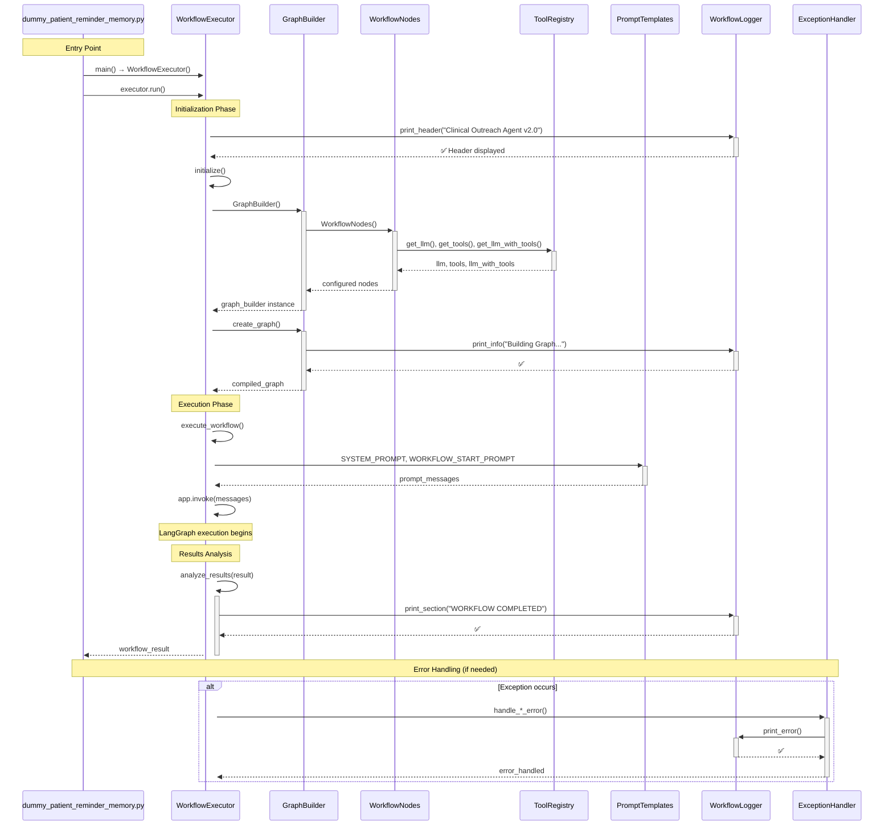

# System Overview - Complete Workflow Sequence

This diagram shows the high-level flow through all modules in the clinical outreach system.

## Key Components:
- **Main Module**: Ultra-clean entry point (15 lines)
- **WorkflowExecutor**: Orchestrates the entire workflow
- **GraphBuilder**: Constructs the LangGraph workflow
- **WorkflowNodes**: Individual processing nodes
- **ToolRegistry**: Centralized tool and LLM configuration
- **PromptTemplates**: All prompts and templates
- **WorkflowLogger**: All output formatting
- **ExceptionHandler**: Centralized error management