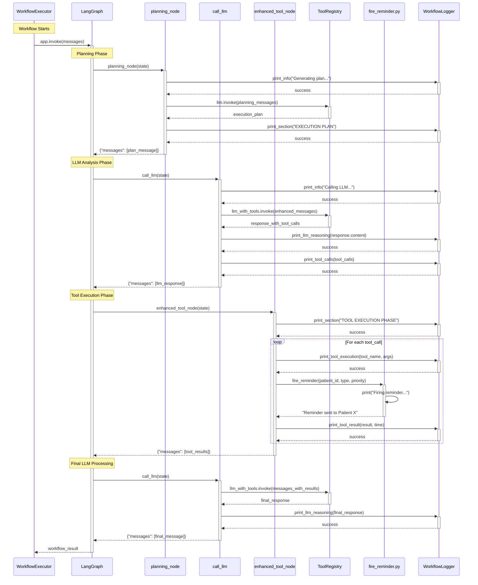

# Detailed Workflow Execution Sequence

This diagram shows the detailed flow through the LangGraph workflow nodes.

## Workflow Phases:
1. **Planning**: Generate execution strategy
2. **LLM Analysis**: Analyze data and determine actions
3. **Tool Execution**: Execute fire_reminder and other tools
4. **Final Processing**: Generate summary and results