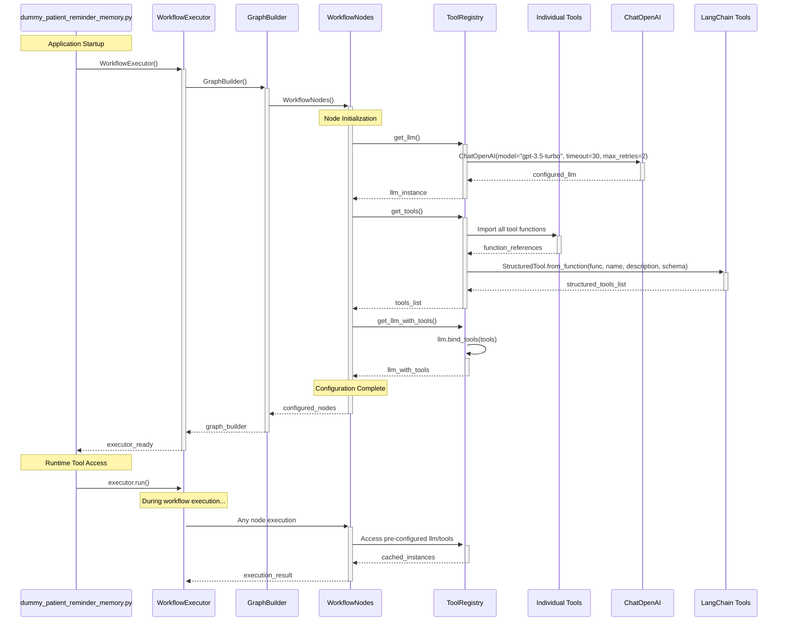

# Configuration and Dependency Flow

This diagram shows how configuration and dependencies are loaded and used.

## Configuration Benefits:
- **Centralized**: All tool and LLM config in ToolRegistry
- **Lazy Loading**: Configuration loaded once at startup
- **Cached**: Instances reused across workflow
- **Modular**: Easy to swap configurations
- **Testable**: Easy to mock for testing