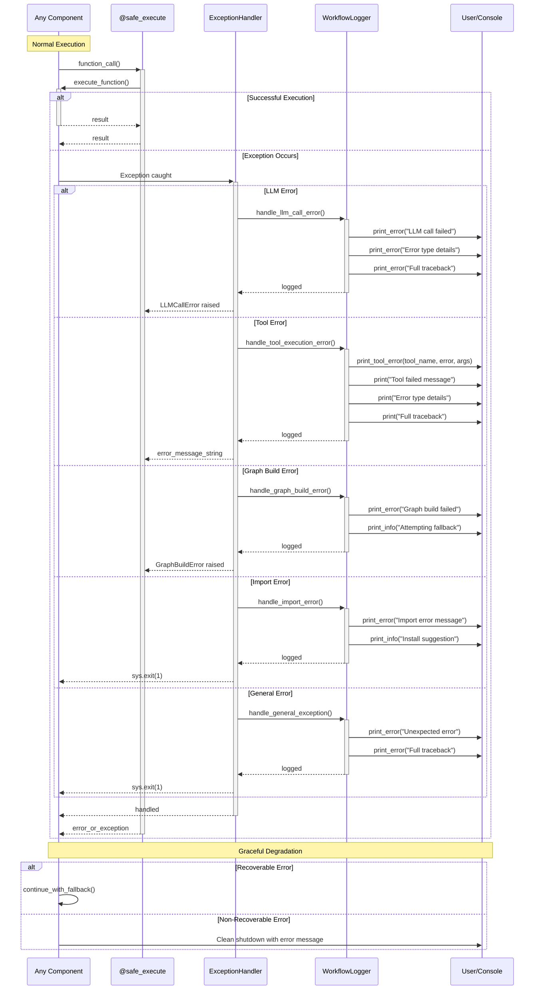

# Error Handling and Exception Flow

This diagram shows how errors are caught, handled, and reported throughout the system.

## Error Handling Strategy

### Exception Types and Responses

#### 1. LLM Errors
- **Cause**: OpenAI API failures, rate limits, network issues
- **Response**: Detailed error logging with retry suggestions
- **Action**: Raise LLMCallError for caller to handle

#### 2. Tool Execution Errors
- **Cause**: Tool function failures, invalid arguments
- **Response**: Log tool name, arguments, and error details
- **Action**: Return error message string to continue workflow

#### 3. Graph Build Errors
- **Cause**: LangGraph construction failures, node configuration issues
- **Response**: Log error and attempt fallback configuration
- **Action**: Raise GraphBuildError if no fallback available

#### 4. Import Errors
- **Cause**: Missing dependencies, module import failures
- **Response**: Clear error message with installation instructions
- **Action**: Clean system exit with error code

#### 5. General Exceptions
- **Cause**: Unexpected errors, programming bugs
- **Response**: Full traceback logging for debugging
- **Action**: Clean system exit to prevent corruption

## Error Handling Features

### Centralized Management
- All error handling logic in ExceptionHandler
- Consistent error formatting across the system
- Single place to modify error handling behavior

### Contextual Responses
- Different handlers for different error types
- Appropriate recovery strategies for each scenario
- Clear distinction between recoverable and fatal errors

### User Experience
- Clear, actionable error messages
- Installation suggestions for missing dependencies
- Graceful degradation where possible

### Development Support
- Full traceback logging for debugging
- Detailed error context and suggestions
- Easy to add new error types and handlers

## Recovery Strategies

### Recoverable Errors
- Tool execution failures: Continue with error message
- LLM temporary failures: Retry or fallback
- Graph build issues: Attempt simplified configuration

### Non-Recoverable Errors
- Missing critical dependencies: Clean exit with instructions
- Fatal configuration errors: Immediate shutdown
- Unexpected system errors: Safe termination with logs