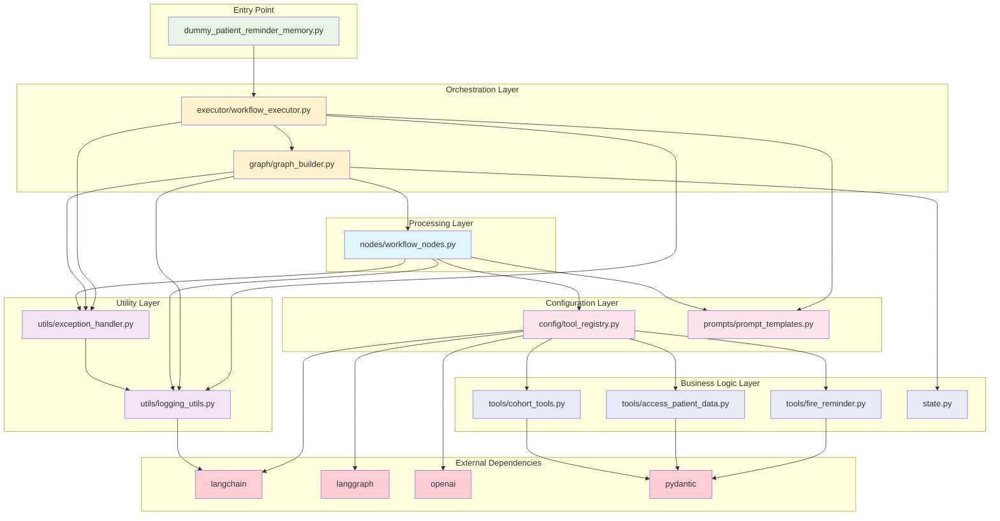

# Module Import Dependencies

This diagram shows the import relationships between all modules.

## Import Hierarchy:
1. **Entry Point**: Ultra-clean main module
2. **Orchestration**: High-level workflow management
3. **Processing**: Individual workflow nodes
4. **Configuration**: Tool and prompt management
5. **Utility**: Cross-cutting concerns (logging, errors)
6. **Business Logic**: Core tools and state
7. **External**: Third-party dependencies